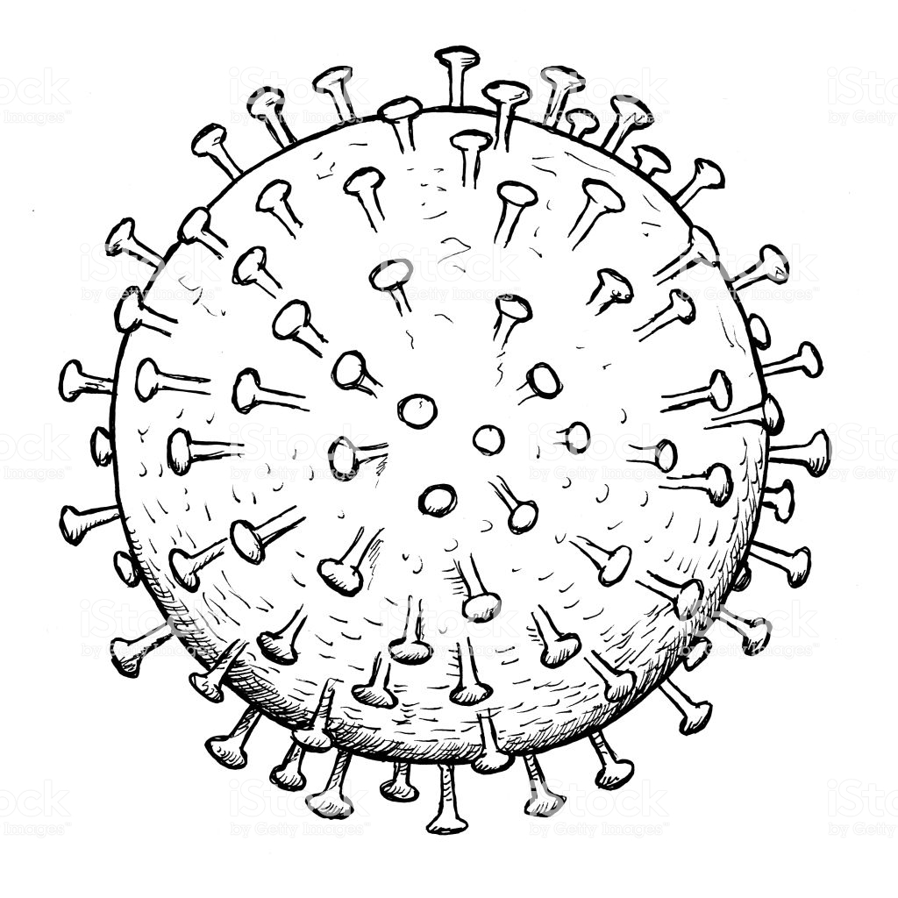
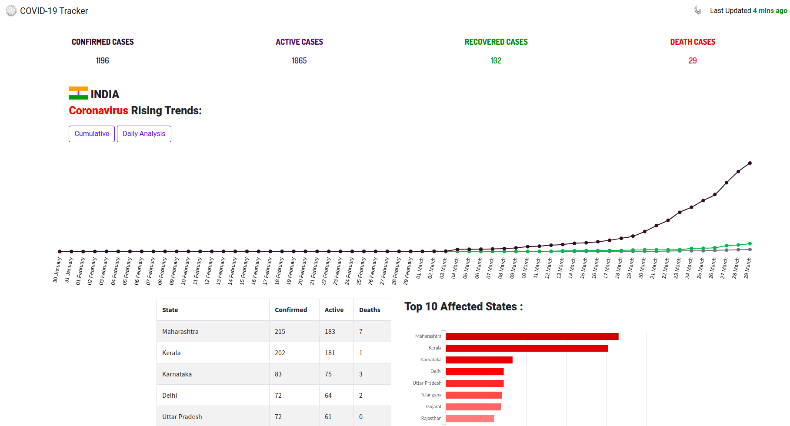

<br />
<p align="center">
  <a href="https://github.com/goliakshay357/covid19-dashboard">
    
  </a>

  <h3 align="center">Covid-19 Dashboard</h3>

  <p align="center">
    A Realtime Dashboard for COVID-19 cases. 
    <br />
    <a href="https://github.com/goliakshay357/covid19-dashboard"><strong>Explore the docs »</strong></a>
    <br />
    <br />
    <a href="https://covid19-india2020.firebaseapp.com/">View Demo</a>
    ·
    <a href="https://github.com/goliakshay357/covid19-dashboard/issues">Report Bug</a>
    ·
    <a href="https://github.com/goliakshay357/covid19-dashboard/issues">Request Feature</a>
  </p>
</p>


<!-- TABLE OF CONTENTS -->
## Table of Contents

* [About the Project](#about-the-project)
  * [Built With](#built-with)
* [Getting Started](#getting-started)
  * [Prerequisites](#prerequisites)
  * [Installation](#installation)
* [Roadmap](#roadmap)
* [Contributing](#contributing)
* [License](#license)
* [Contact](#contact)
* [Acknowledgements](#acknowledgements)

<!-- ABOUT THE PROJECT -->
## About The Project




This project main aim is to bring awarness about coronavirus and perform analysis regarding the COVID-19 epidemic.This dashboard updates with new data automatically with REST without requiring any expertise.
### Built With
* [Angular](https://angular.io)
* [ChartJS](https://chartjs.org)
* [BrainJS](https://brain.js.org)


<!-- GETTING STARTED -->
## Getting Started

Instructions on setting up your project locally.To get a local copy up and running follow these simple example steps.

### Prerequisites

This is an example of how to list things you need to use the software and how to install them.
* npm
```sh
npm install npm@latest -g
```

### Installation

1. Clone the repo
```sh
git clone https://github.com/goliakshay357/covid19-dashboard.git
```
2. Move inside the project directory
```sh
cd covi19-dashboard
```

3. Install NPM packages
```sh
npm i
```
<!-- ROADMAP -->
## Roadmap
* Add choropleth map
* Machine learning predictions using supervised modelling
* Home page designs optimizations

<!-- CONTRIBUTING -->
## Contributing

Contributions are what make the open source community such an amazing place to be learn, inspire, and create. Any contributions you make are **greatly appreciated**.

1. Fork the Project
2. Create your Feature Branch (`git checkout -b feature/AmazingFeature`)
3. Commit your Changes (`git commit -m 'Add some AmazingFeature'`)
4. Push to the Branch (`git push origin feature/AmazingFeature`)
5. Open a Pull Request
